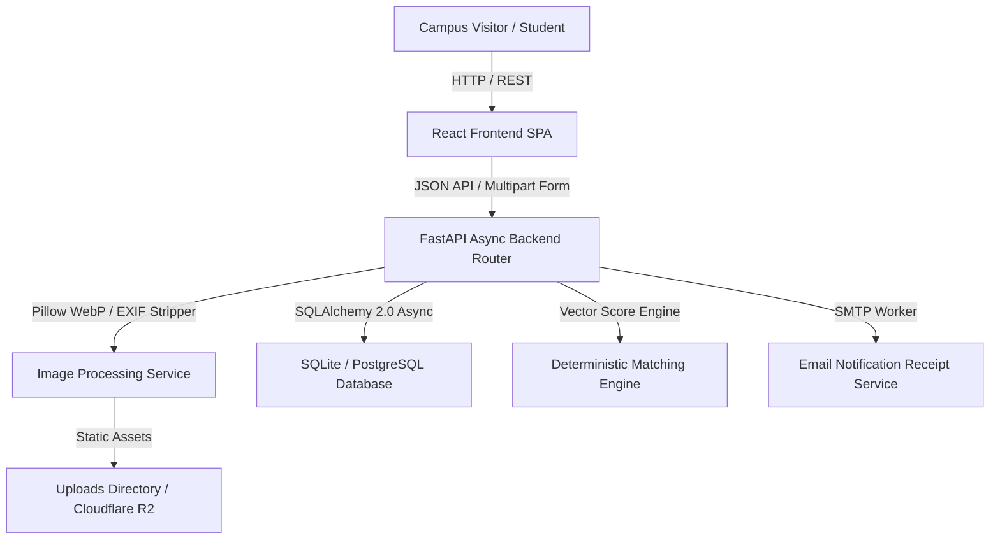
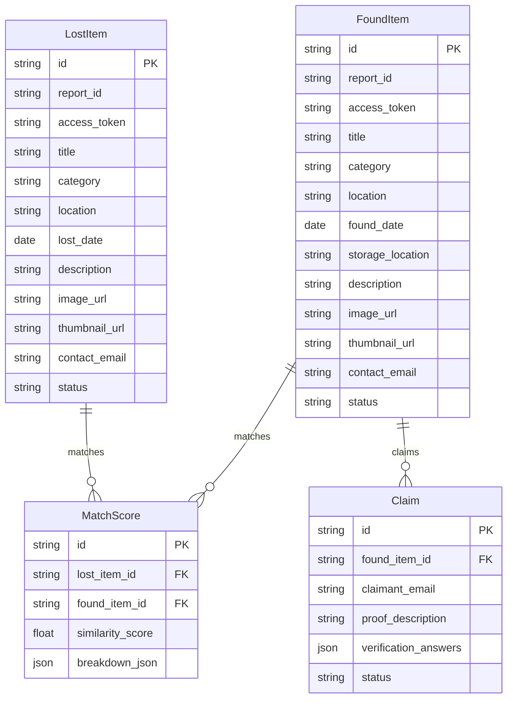
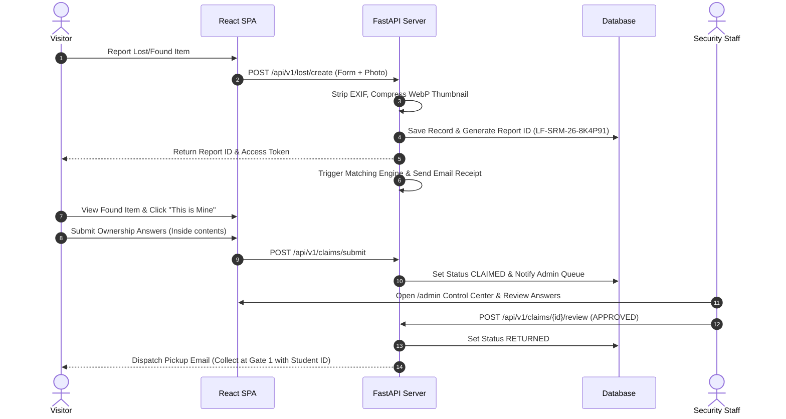

# 🔍 Lost & Found — Campus Item Recovery Platform

> A production-grade, secure, cloud-native campus item recovery platform built with FastAPI, React, PostgreSQL/SQLite, TailwindCSS, Docker, and Kubernetes.

---

## 📌 Executive Overview

**Lost & Found** replaces inefficient physical lost-and-found noticeboards with an automated digital recovery workflow. Designed for SRM University campus deployment (~10,000 users), the platform allows students, faculty, staff, and visitors to log lost items, turn in found items, verify ownership proof online, and collect physical items from the Campus Security Office without creating a user account.

### 🌟 Key Product Innovations
- **No User Account Requirement**: Uses unguessable Report IDs (`LF-SRM-26-8K4P91`) and 32-character secret tokens (`access_token`) sent via automated email receipts.
- **Privacy Shield**: Hides sensitive user contact details from public listings. Ordinary users never directly contact each other.
- **Dual Image & EXIF Removal Pipeline**: Strips GPS EXIF metadata, resizes photos to max 1200px, generates 300px WebP thumbnails, and serves assets securely.
- **Deterministic Weighted Matching Engine**: Compares category (30%), location (20%), brand (15%), color (15%), date proximity (10%), and text overlap (10%).
- **Ownership Proof Claim Workflow**: Claimants answer verification questions (inside contents, unique marks) which Security Staff review in a hidden control center (`/admin`).
- **Physical Chain of Custody**: Every found item is directed to the Campus Security Office (Gate 1) for verified handover.

---

## 🏗️ System Architecture



---

## 🗄️ Database Entity Relationship (ERD) Diagram



---

## 🔄 End-to-End Recovery Sequence



---

## 📂 Repository Directory Structure

```text
lost-and-found/
├── .github/
│   └── workflows/
│       └── ci-cd.yml                # Automated GitHub Actions CI/CD
├── backend/
│   ├── app/
│   │   ├── api/v1/                  # API Routers (lost, found, track, search, claims, admin)
│   │   ├── core/                    # Settings & Configurations
│   │   ├── database/                # SQLAlchemy Async Session & Base Models
│   │   ├── matching/                # Weighted Vector Similarity Engine
│   │   ├── models/                  # Database Models (LostItem, FoundItem, Claim, Match, Audit)
│   │   ├── notifications/           # Email Dispatch Service
│   │   ├── schemas/                 # Pydantic Data Validation Schemas
│   │   ├── security/                # Auth Dependencies & JWT Handling
│   │   └── services/                # Image Processing & EXIF Stripper
│   ├── tests/                       # Unit & Integration API Tests
│   ├── Dockerfile                   # Python 3.9 Backend Docker Spec
│   └── requirements.txt             # Python Dependencies
├── frontend/
│   ├── src/
│   │   ├── components/              # React Components (ItemCard, ItemDetailsModal, Navbar, Footer)
│   │   ├── pages/                   # Pages (Home, Search, TrackReport, RecoverReport, Claims, Admin)
│   │   ├── services/                # Axios API Service Client
│   │   └── styles/                  # Global Tailwind CSS Styles
│   ├── Dockerfile                   # Multi-stage Nginx Vite Frontend Docker Spec
│   └── package.json                 # Node Dependencies
├── docs/                            # IEEE Enterprise Software Specs (SRS, SDD, DevOps, Security)
├── infra/                           # Docker Compose, Kubernetes Manifests, Nginx, Prometheus
├── docker-compose.yml               # Complete Multi-Container Orchestration
├── README.md                        # Primary Documentation
└── .gitignore
```

---

## ⚡ Quickstart Guide

### 1. Local Development Setup

#### Backend (FastAPI Python 3.9+)
```bash
cd backend
python3 -m venv venv
source venv/bin/activate  # On Windows: venv\Scripts\activate
pip install -r requirements.txt

# Run FastAPI server on port 8000
python3 -m uvicorn app.main:app --port 8000 --reload
```
API Documentation will be active at: `http://localhost:8000/docs`

#### Frontend (Vite + React + TypeScript)
```bash
cd frontend
npm install

# Run Vite dev server on port 5173
npm run dev
```
Web App will be active at: `http://localhost:5173`

---

### 2. Multi-Container Orchestration with Docker

Run the entire application stack (Frontend, Backend, Database, Nginx Reverse Proxy, Prometheus) using Docker Compose:

```bash
docker-compose up --build -d
```

---

## 🧪 Testing & Verification

Run automated backend pytest suite:
```bash
cd backend
pytest tests/
```

Test production frontend build:
```bash
cd frontend
npm run build
```

---

## 🛡️ Security & Privacy Features
- **EXIF Metadata Stripping**: Automatically removes GPS coordinates from uploaded JPEG/PNG images prior to saving.
- **Privacy Shield**: Ordinary users cannot see phone numbers or email addresses of other users.
- **Sequential Attack Protection**: Uses unguessable 6-char alphanumeric report codes (`LF-SRM-26-8K4P91`).
- **Tokenized Route Protection**: `/track` validates both Report ID and secret 32-char access token.
- **Role-Based Access Control (RBAC)**: Admin routes (`/admin`) require Security Staff credentials.

---

## 📄 License
Designed for **SRM University Campus Lost & Found Platform**. Distributed under the MIT License.
