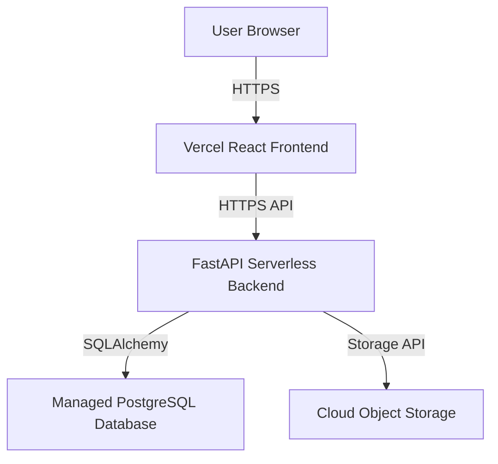

# Cloud Lost & Found

**Live Platform:** [https://lost-and-found-sigma-three.vercel.app](https://lost-and-found-sigma-three.vercel.app)

Cloud Lost & Found is a secure, cloud-native item recovery platform built with FastAPI and React. It modernizes the traditional lost-and-found process by digitizing item reporting, enforcing privacy through token-based tracking, and providing a centralized moderation dashboard for security personnel.

## The Problem and Solution

Physical lost-and-found systems rely on noticeboards and unverified claims, leading to disorganization, privacy risks from publicly displayed phone numbers, and inefficiencies in returning items to their rightful owners. 

This platform solves these issues by automating the digital recovery workflow. Users can log lost items or turn in found items through a streamlined web interface. Instead of requiring user accounts, the system generates unguessable Report IDs and secure access tokens sent directly via email. A deterministic matching engine actively compares lost and found reports, while an ownership proof workflow ensures that claimants can securely verify their identity before physical collection. Sensitive user contact details are strictly hidden from public listings.

## Features

- **Account-less Tracking:** Users interact with their reports via secure, 32-character access tokens delivered to verified email addresses.
- **Privacy Enforcement:** Contact details are strictly obfuscated. Users communicate indirectly through the platform's claiming system.
- **Automated Matching Engine:** A weighted deterministic engine compares category, location, brand, color, and text overlap to suggest potential matches between lost and found items.
- **Image Processing Pipeline:** Uploaded images are strictly validated, resized, and stripped of EXIF metadata (including GPS coordinates) before being served securely.
- **Security & Moderation:** Features Role-Based Access Control (RBAC) for administrators, rate limiting, XSS protection, and a manual review queue for flagged content and claims.

## System Architecture

The application follows a decoupled, serverless architecture optimized for scalability and zero-maintenance deployment.



## Technical Stack

- **Frontend:** React, TypeScript, Vite, TailwindCSS
- **Backend:** Python 3.9+, FastAPI, SQLAlchemy 2.0, Pydantic
- **Database:** PostgreSQL
- **Infrastructure:** Vercel (Frontend & Serverless Functions), Upstash (Redis Rate Limiting)
- **Storage:** Cloudinary (Asset hosting and transformations)
- **Email:** SMTP Integration

## How It Works

1. **Reporting an Item:** A user submits a lost or found report via the public portal, including item details and optional images.
2. **Verification:** The user verifies their submission via an automated email. The report is assigned a secure tracking token and placed into the moderation queue or published directly based on content filtering.
3. **Matching & Claiming:** The automated matching engine analyzes new reports against existing database entries. If a user believes a found item is theirs, they submit a claim detailing specific ownership proofs (e.g., lock screen wallpaper, internal contents).
4. **Moderation & Resolution:** Administrators review pending claims through the secure dashboard. Once a claim is approved, the claimant is instructed to collect the physical item from the central security office, and the digital record is archived.

## Local Development Setup

### Note on Image Uploads
> [!NOTE]
> This platform uses Cloudinary's AWS Rekognition add-on for automated image moderation, which is limited to 50 operations per month on the free tier. If you encounter an error when uploading an image (e.g., the platform is unable to proceed), it means the monthly quota has been reached. In this case, you can simply proceed with submitting your report without uploading an image.

### Backend
```bash
cd backend
python3 -m venv venv
source venv/bin/activate
pip install -r requirements.txt
uvicorn app.main:app --port 8000 --reload
```
API Documentation will be available at `http://localhost:8000/docs`

### Frontend
```bash
cd frontend
npm install
npm run dev
```
Web App will be available at `http://localhost:5173`

## License

Distributed under the MIT License.
