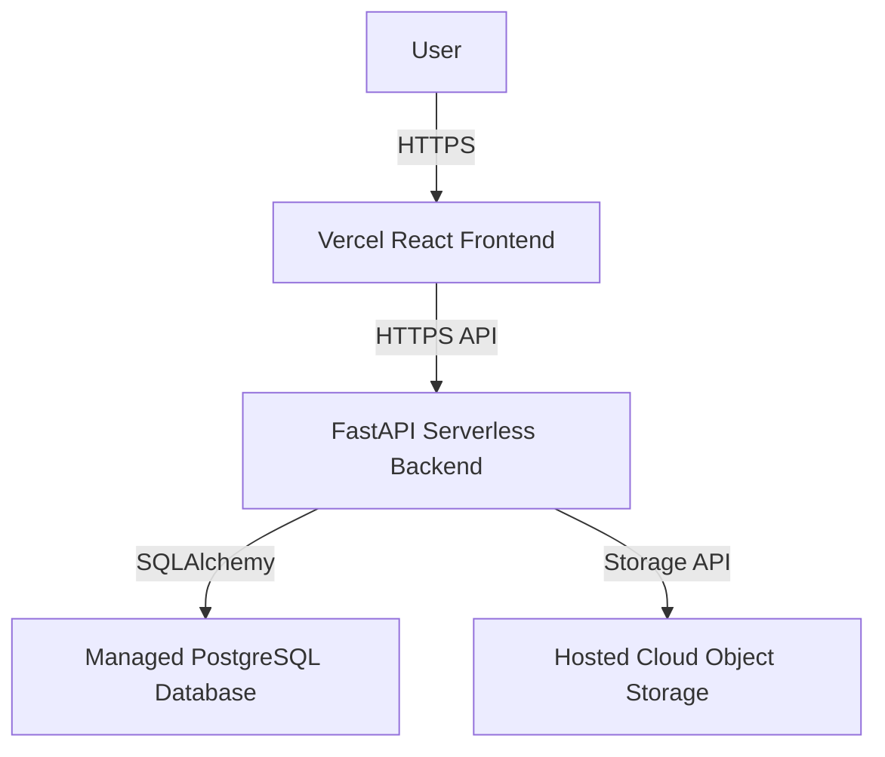
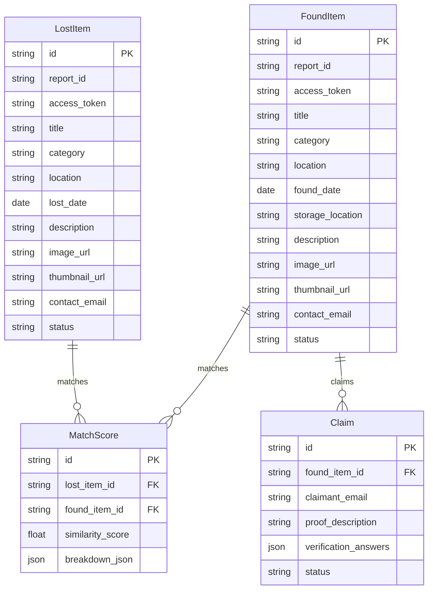

# 🔍 Cloud Lost & Found — Campus Item Recovery Platform

> A production-grade, secure, cloud-native campus item recovery platform built with FastAPI, React, PostgreSQL/SQLite, and TailwindCSS.

---

## 📌 Executive Overview

**Lost & Found** replaces inefficient physical lost-and-found noticeboards with an automated digital recovery workflow. Designed for SRM University campus deployment (~10,000 users), the platform allows students, faculty, staff, and visitors to log lost items, turn in found items, verify ownership proof online, and collect physical items from the Campus Security Office without creating a user account.

### 🌟 Key Product Innovations
- **No User Account Requirement**: Uses unguessable Report IDs (`LF-SRM-26-8K4P91`) and 32-character secret tokens (`access_token`) sent via automated email receipts.
- **Privacy Shield**: Hides sensitive user contact details from public listings. Ordinary users never directly contact each other.
- **Dual Image & EXIF Removal Pipeline**: Strips GPS EXIF metadata, resizes photos to max 1200px, generates 300px WebP thumbnails, and serves assets securely.
- **Deterministic Weighted Matching Engine**: Compares category (30%), location (20%), brand (15%), color (15%), date proximity (10%), and text overlap (10%).
- **Ownership Proof Claim Workflow**: Claimants answer verification questions (inside contents, unique marks) which Security Staff review in a hidden control center (`/admin`).
- **Physical Chain of Custody**: Every found item is directed to the Campus Security Office (Gate 1) for verified handover.

---

## 🏗️ System Architecture



---

## 🛡️ Security & Privacy Features
- **JWT & Role-Based Access Control (RBAC)**: Admin routes (`/admin`) require Security Staff credentials.
- **Rate Limiting**: Protects sensitive endpoints (`/login`, `/register`, report creation) from brute-force and abuse.
- **Input Validation & XSS Protection**: Strict Pydantic models and backend HTML escaping on all user-controlled text.
- **SQL Injection Protection**: Built securely with SQLAlchemy 2.0 parameterized queries.
- **File Upload Validation**: Enforces MIME types (JPEG, PNG, WebP), checks file sizes, strips EXIF metadata, and generates secure UUID filenames.
- **Safe Error Handling**: Prevents leakage of internal stack traces, database schemas, and credentials to the client.
- **CORS & Security Headers**: Strictly limited to production domains with comprehensive security policies.
- **Password Hashing**: Secure bcrypt/argon2 hashing for all staff accounts.

---

## 🗄️ Database Entity Relationship (ERD) Diagram



---

## 📂 Repository Directory Structure

```text
lost-and-found/
├── .github/
│   └── workflows/
│       └── ci-cd.yml                # Automated GitHub Actions CI/CD
├── backend/
│   ├── app/
│   │   ├── api/v1/                  # API Routers (lost, found, track, search, claims, admin)
│   │   ├── core/                    # Settings & Configurations
│   │   ├── database/                # SQLAlchemy Async Session & Base Models
│   │   ├── matching/                # Weighted Vector Similarity Engine
│   │   ├── models/                  # Database Models (LostItem, FoundItem, Claim, Match, Audit)
│   │   ├── notifications/           # Email Dispatch Service
│   │   ├── schemas/                 # Pydantic Data Validation Schemas
│   │   ├── security/                # Auth Dependencies & JWT Handling
│   │   └── services/                # Image Processing & Storage Abstraction
│   ├── tests/                       # Unit & Integration API Tests
│   └── requirements.txt             # Python Dependencies
├── frontend/
│   ├── src/
│   │   ├── components/              # React Components
│   │   ├── pages/                   # Pages (Home, Search, TrackReport, Claims, Admin)
│   │   ├── services/                # Axios API Service Client
│   │   └── styles/                  # Global Tailwind CSS Styles
│   └── package.json                 # Node Dependencies
├── docs/                            # IEEE Enterprise Software Specs (SRS, SDD, Security)
├── scripts/                         # Testing Scripts
└── README.md                        # Primary Documentation
```

---

## ⚙️ DevOps Architecture Archive

The project previously included a complete Docker/Kubernetes-based deployment architecture including Kubernetes StatefulSets, persistent volumes, HPA, Ingress, NetworkPolicies, MinIO, Prometheus, and Grafana.

This implementation has been preserved in the `devops-archive` branch for educational and engineering reference. The `main` branch now contains the simplified, zero-cost deployable Serverless architecture.

---

## 🧪 Testing & Verification

Automated pipelines verify backend logic and security validations.

Run automated backend pytest suite:
```bash
cd backend
python -m pytest tests/ -v
```

Security Regression testing:
```bash
python scripts/security_regression.py
```

Test production frontend build:
```bash
cd frontend
npm ci
npm run build
```

---

## ⚡ Quickstart Guide

### 1. Local Development Setup

#### Backend (FastAPI Python 3.9+)
```bash
cd backend
python3 -m venv venv
source venv/bin/activate
pip install -r requirements.txt

# Run FastAPI server on port 8000
uvicorn app.main:app --port 8000 --reload
```
API Documentation will be active at: `http://localhost:8000/docs`

#### Frontend (Vite + React + TypeScript)
```bash
cd frontend
npm install

# Run Vite dev server on port 5173
npm run dev
```
Web App will be active at: `http://localhost:5173`

---

## 📄 License
Designed for **SRM University Campus Lost & Found Platform**. Distributed under the MIT License.
